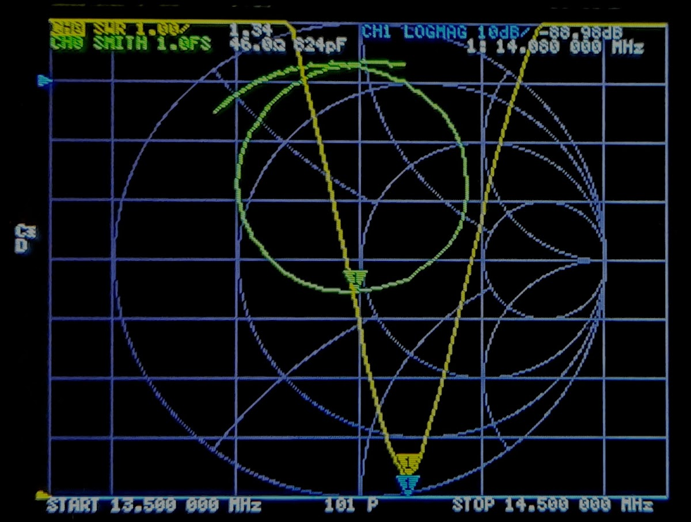

# S11 measurements of the loop antenna

Measurements of the S11 parameters the loop antenna build. Conducted with a NanoVNA and exported using NanoVNAQt. 

An example measurement can be seen below. The screenshot is taken directly on the NanoVNA and it shows the antenna permance in the 20m band.

## Description of the content
* Plotting: scripts used to plot the readings stored in the touchstone files.
* Office Location March 22: accurate measurements conducted with a calibrated device.
* Device uncalibrated: old measurements with uncalibrated device. Do not use.